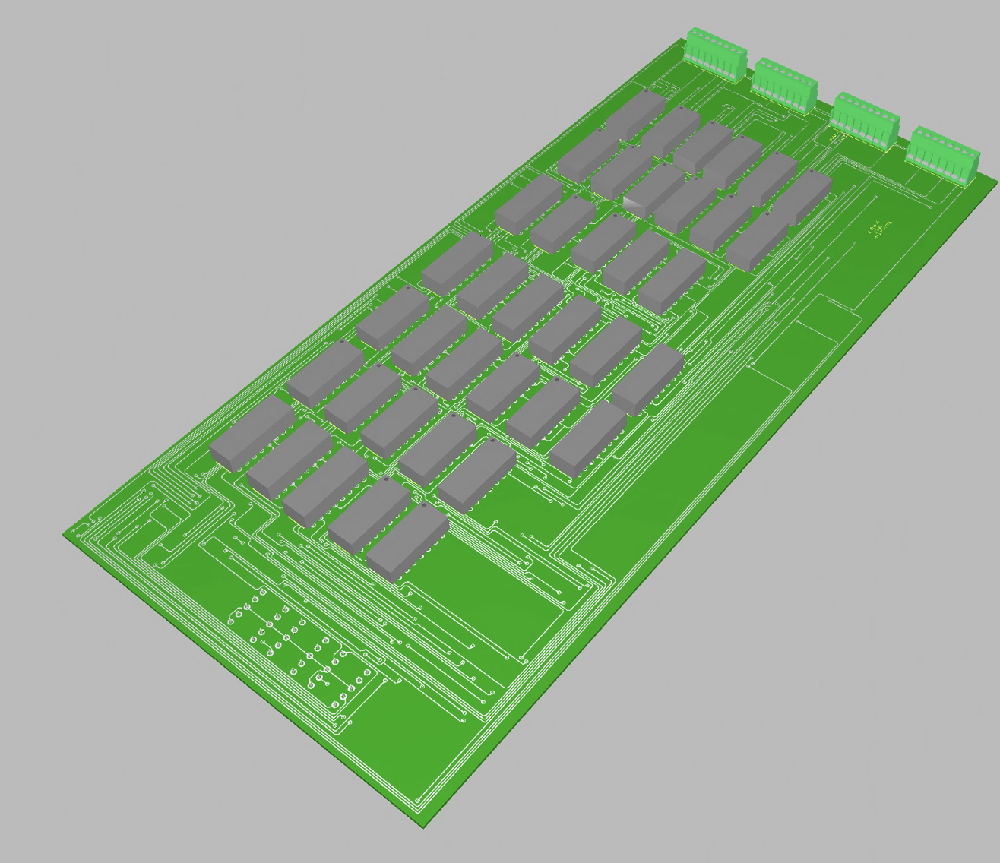
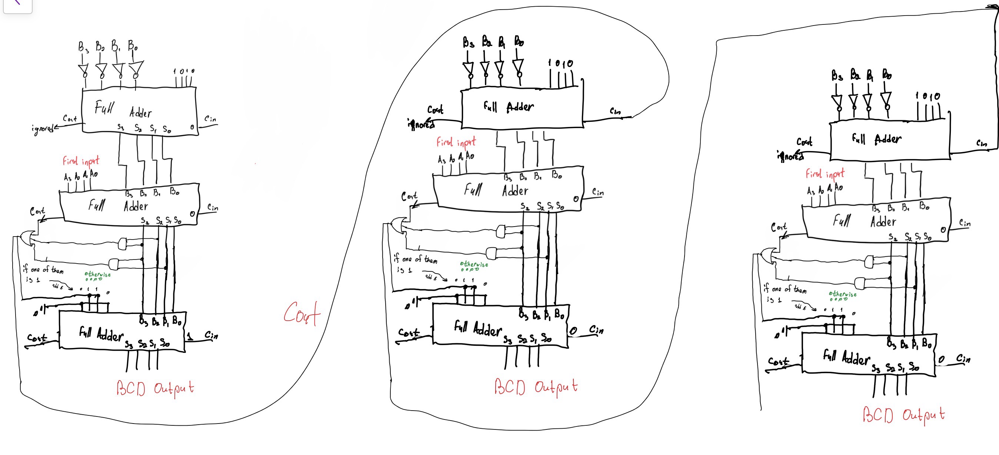

# LapTimer – Subtraction Module

Team of 5 students.  
My role: digital circuit designer.  
Developed the subtraction module responsible for calculating the time difference between two stopwatch readings.  

---

## Overview
- **Full project description:** [Overview](docs/overview.md)
- **Features:** BCD-based subtraction, carry/borrow correction, RC-delay capture, and 7-segment display output.
- **Technology:** Texas Instruments 74LS series logic (Full Adders, Flip-Flops, Inverters, XOR/AND/NOR gates).
- **Simulation & PCB:** Designed in [Multisim](schematic/multisim) and [Ultiboard](schematic/pcb) (with 3D projection).

---

## Photo Demonstration
Circuit in Multisim:  

PCB 3D view (Ultiboard):  

---

## Video Demonstration
System in Action: [▶ Watch on YouTube](https://youtu.be/your_video_link)

---

## Problem-Solving Process
**Full list of challenges and their sollutions:** [Problems & Solutions](docs/problems_solutions.md)

**Example of handwritten handnotes:**

➡️ [See rest early calculations and design notes here](docs/hand_notes)

---

## Future Improvements
At this point in development, one of the chief weaknesses in the circuit remains its size.

As this project was done in year one, when both high-level programming concepts and low-level programming concepts had not yet been introduced in class,
The design was purely dependent on hardware logic based on 74LS-series ICs.
But there are quite a few ways in which this system can be improved and minimized in the future:

1. **Microcontroller Integration**

One possible enhancement could be to use a **microcontroller** (like Arduino or ATmega) to create the subtraction logic.
This would enable a single logic IC to replace multifaceted logic ICs. It was intended to simplify wiring and reduce board sizes.

2. **Implementation using VHDL on a PLD/CPLD**

One possible solution using logic design re-engineering would involve redesigning using **Hardware Description Language (VHDL)** to run the logic design on a **programmable logic device (PLD or CPLD)**. This solution would retain the same digital logic design structure for the original project but would improve its speed performance. but with a far smaller footprint, so that everything remains purely hardware-based.
