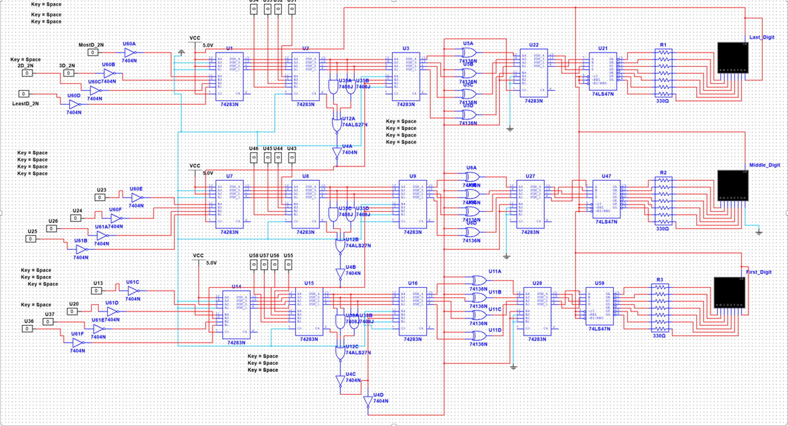

# LapTimer – Subtraction Module

Team of 5 students.  
My role: digital circuit designer.  
Developed the subtraction module responsible for calculating the time difference between two stopwatch readings.  

---

## Overview
- **Full project description:** [Overview](docs/overview.md)
- **Features:** BCD-based subtraction, carry/borrow correction, RC-delay capture, and 7-segment display output.
- **Technology:** Texas Instruments 74LS series logic (Full Adders, Flip-Flops, Inverters, XOR/AND/NOR gates).
- **Simulation & PCB:** Designed in [Multisim](schematic/multisim) and [Ultiboard](schematic/pcb) (with 3D projection).

---

## Photo Demonstration
Circuit in Multisim:  

PCB 3D view (Ultiboard):  

---

## Video Demonstration
System in Action: [▶ Watch on YouTube](https://youtu.be/your_video_link)

---

## Problem-Solving Process
**Full list of challenges and their sollutions:** [Problems & Solutions](docs/problems_solutions.md)

**Example of handwritten handnotes:**

➡️ [See rest early calculations and design notes here](docs/hand_notes)

---

## Future Improvements

