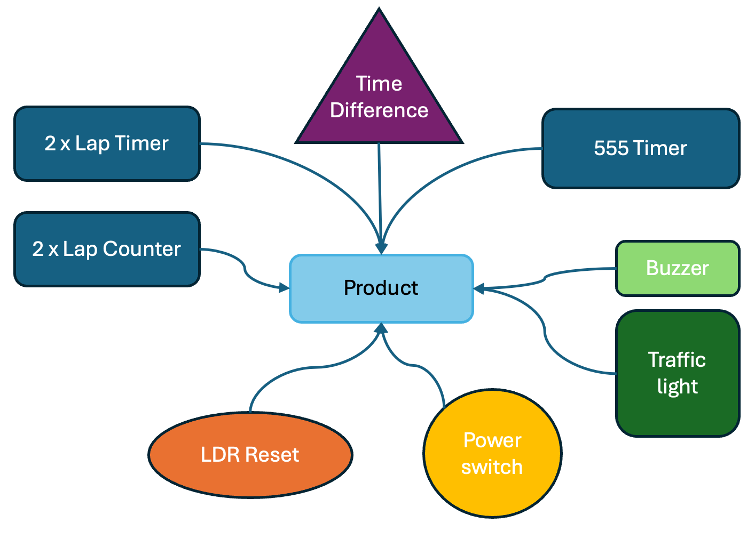

The project is a digital stopwatch system for measuring the race laps. The system consists of several interlinked circuits in which every circuit is specially designed to have a specific function in getting an accurate and precise time reading. The **Lap Timer** is the central part of the system in which counting and displaying the passed time are done.

Apart from the stopwatch function, the system also features a **traffic light** red, yellow, and green sequence in advance of a buzzer element providing an auditory cue as race starter. In order to measure completed laps, a **Lap Counter** exsists allowing real-time counting of laps per vehicle. Finally, a **"Subtraction" Circuit** is incorporated to calculate the difference between the time of two drivers and offer the best performance analysis by carrying out the subtraction of the two stopwatches.

With the incorporation of these components, the system provides a structured and effective solution to the calculation of lap time, and as such, it is appropriately placed in racing settings where precision and consistency are very precious.

